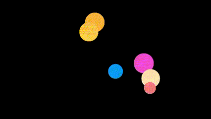

# Squiggly

A standalone [esoteric language](https://en.wikipedia.org/wiki/Esoteric_programming_language) designed for simple game development

## Want to write a program in this language?

1. [Download the latest release](https://github.com/CodeSample15/Squiggly/releases/latest)
2. Check out the [language guide](/guide.md) to get started!

## Examples:

Below are some examples of programs written in Squiggly.


[flappy_bird.sqgly](/console_games/flappy_bird.sqgly)


[spots.sqgly](/console_games/spots.sqgly)


[colorTest.sqgly](/console_games/colorTest.sqgly)

As you can see, the idea of this language is to create simple programs with relatively simple code.

## Build/Run instructions:

> Note: make sure all submodules have been pulled in your local clone of the repo before building for the first time

* From the root directory of the project, create build folder: `mkdir build && cd build`
* Run cmake: `cmake ../`
* Build the project: `make`
* Run Squiggly with: `./squiggly <filename>`
* Install: `make install`

> WINDOWS USERS: If you plan to build from source, I recommend using [clang](https://releases.llvm.org/download.html) and [ninja](https://ninja-build.org/) to build the project.

## *...why?*

- **Why did you make this project?** 
    - Good question! My goal for this project was to make an interpreter capable of being easily ported to different devices (such as the handheld Raspberry Pi game console I made as a test). This allows anyone to easily develop and test game scripts on their own computer before downloading them to any device with Squiggly installed.
    - This language is designed around game development, so I believe it will be a unique way to develop simple games. I love using scripting languages to throw something cool together, and I hope that Squiggly will be a fun way to do just that.
    - The main reason however: fun! I wanted to see what I could do with what little I know of programming languages. I've learned a lot from building Squiggly and hope to eventually revisit this idea with a more... intelligent way of designing it.
- **Why should I use this project?**
    - This interpreter will open it's own graphical window when running a script where you can play and test games. If game dev is your thing and you're bored, I recommend trying to make your own Squiggly program.
    - Squiggly was built with portability in mind, so games written in this langauge can be played on many different devices. Currently, I have a port of Squiggly that runs on a Raspberry Pi 02W with a small TFT screen.
    - If you like experimenting with crappy software, this is definitely a fun way to do so (in my unbiased opinion).
- **Why did you call it that?**
    - This project is named "squiggly" due to the different built-in functionalities provided by this language which are accessed by "squiggly" shapes (@, $, ^). More information about these symbols in the [project's guide](/guide.md)
    - The project was going to be named "squiggle" but according to [the complete list of esoteric languages](https://esolangs.org/wiki/Language_list), the name "squiggle" is already taken.

## How does it work?

- Since Squiggly was a challenge for myself, I did very little research behind how interpreted languages are supposed to be made (bad idea, I know).
- The system I came up with is briefly outlined below:
- Squiggly has 3 main components:
    - **Linter**:
        - The Linter is what runs before everything else. It ensures syntax is somewhat correct and removes unnecessary whitespace and comments. After this process, parsing the raw text becomes much more controlled.
    - **Tokenizer**:
        - The Tokenizer runs after the Linter and converts the raw text into a vector of "tokens". These tokens are representations of each line and is a somewhat "compiled" version of the main code. For example, a line which declares a variable would be tokenized into a declare token, with the name and type of the declared variable stored in variables which will remove the need to parse the raw text again.
        - The tokenizer deletes the raw text from memory after tokenizing a program, freeing a small bit of memory.
    - **Runner**:
        - The Runner can only execute after the Tokenizer has tokenized an entire program into memory. The Runner goes token by token, executing different functions based off of the type of token and the data contained in that token.
        - To keep track of variables declared in a Squiggly program, the Runner uses a virtual memory block and SVariables (Squiggly Variables), which are structs containing a name, type, and pointer to the actual variable value. These SVariables make it easier to search for variables when they're referenced later in programs.

### Under the hood:

- Squiggly uses 2 main libraries to function:
    - [exprtk](https://github.com/ArashPartow/exprtk): Mathmatical equation string parsing
    - [SFML](https://github.com/SFML/SFML): Graphical frontend (creating a window, drawing frames to window)

- For the Raspberry Pi console build, Squiggly also uses a [fork](https://github.com/CodeSample15/ST7735_TFT_RPI) of [this TFT device library](https://github.com/gavinlyonsrepo/ST7735_TFT_RPI) to interface with an external TFT screen device. The fork includes an in-memory screen buffer which is used for more consistent frame rates and more efficient data-writing. For input control, Squiggly uses a simple [joystick library](https://github.com/drewnoakes/joystick/tree/master) to get values from a USB controller.

## Example squiggly syntax:

Test code can be found in the [/test_scripts](/test_scripts/) folder, but here's a small sample of what Squiggly code looks like:

``` Python
:VARS: {
    OBJECT test

    float xVel
    float yVel
}

:START: {
    xVel = 0
    yVel = 0

    test.x = 0
    test.y = 0
    test.width = 20
    test.height = 20

    test.setColor(173, 245, 66)
    test.setShape(@TRIANGLE)
    test.setSolid(true) #turn fill off
}

:UPDATE: {
	test.x += 40 * xVel * $DTIME
    test.y += 40 * yVel * $DTIME

    xVel += $JOYSTICK_X
    yVel -= $JOYSTICK_Y

    xVel *= 0.8
    yVel *= 0.8

    ^PRINT("X: " + test.x + "   Y: " + test.y + "    Rot: " + test.rotation)

    if($A_BTN) {
        test.rotation -= 5
        test.setSolid(true)
    }

    if($B_BTN) {
        test.rotation += 5
        test.setSolid(false)
    }

    test.draw()
}
```